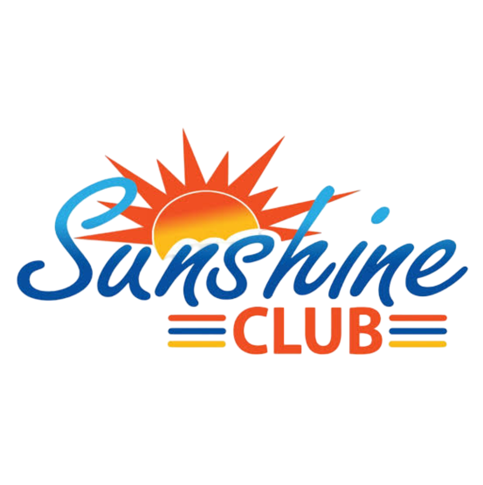

# ☀️ Sun Shine Club Kendupalli

<p align="center">
  
</p>

<h3 align="center">Official Website of Sun Shine Club, Kendupalli</h3>

<p align="center">
  A modern, responsive and SEO-friendly community club website featuring events,
  festivals, members, galleries, ID cards, certificates and digital verification tools.
</p>

---

## 📖 About the Project

**Sun Shine Club Kendupalli** is a digital platform for the community activities and management of Sun Shine Club, Kendupalli.

The website provides information about the club, members, events, festivals and activities, together with digital tools for ID cards, certificates and verification.

### Main goals

- 🚀 Fast and lightweight
- 📱 Fully responsive
- 🔍 SEO friendly
- ♿ Accessible
- 🎨 Modern UI
- 🔐 Secure API architecture
- ☁️ Cloud-ready media and services

---

# ✨ Features

## 🏠 Website

- Home
- About Us
- Members
- Events
- Festivals
- Gallery
- Contact
- Donate
- Digital Tools

## 👥 Member Directory

The member section supports:

- Member profile cards
- Member photographs
- Member information
- Responsive layouts
- Descriptive image `alt` text
- Local or CDN-hosted images

## 🪪 Digital ID Card System

### Features

- ID Card Generator
- ID Card Verification
- Member ID
- Member photograph
- Club information
- Validity information
- QR verification
- Printable/downloadable cards

```text
club-id-card/
├── id-generator.html
├── verify.html
└── ...
```

## 📜 Certificate System

### Features

- Certificate templates
- Certificate generation
- Issued certificate listing
- Certificate verification
- Certificate IDs
- QR verification support

```text
club-certificate/
├── verify.html
├── template.html
├── issued-certificate.html
└── ...
```

---

# 🛠️ Digital Tools

| Tool | Description |
|------|-------------|
| Verify ID Card | Verify a club member ID |
| ID Card Generator | Generate official ID cards |
| Verify Certificate | Verify an issued certificate |
| Certificate Template | View certificate design |
| Issued Certificates | View issued certificates |
| Member Directory | Browse club members |

---

# 🖼️ Gallery

The gallery supports:

- Festival filtering
- Year filtering
- Image/video filtering
- Dynamic rendering
- Lightbox navigation
- Keyboard navigation
- Touch swipe navigation
- Responsive layouts

Example data structure:

```javascript
const GALLERY_DATA = {
    ganesh: {
        2026: {
            title: "Ganesh Puja 2026",
            description:
                "Ganesh Puja celebrations at Sun Shine Club Kendupalli in 2026.",
            images: [
                {
                    src: "../assets/gallery/ganesh/2026/img1.jpg",
                    alt: "Ganesh Puja celebration at Sun Shine Club Kendupalli 2026"
                }
            ],
            videos: []
        }
    }
};
```

Only the selected festival/year should be rendered so that the browser does not unnecessarily request every gallery image.

---

# ⚡ Gallery Performance

The gallery is designed to avoid loading the complete image collection on the initial page load.

### Performance strategy

```text
Festival selected
      ↓
Year selected
      ↓
Media selected
      ↓
Load only matching data
      ↓
Render gallery
```

Recommended image attributes:

```html

```

---

# 🔍 SEO

SEO features include:

- Unique page titles
- Meta descriptions
- Semantic HTML
- Descriptive image `alt` text
- XML sitemap
- Image sitemap
- Responsive design
- Mobile-friendly pages
- Clean internal navigation
- Descriptive content

## Image SEO

Use descriptive filenames where possible:

```text
ganesh-puja-kendupalli-2026-01.jpg
ganesh-puja-kendupalli-2026-02.jpg
```

and descriptive `alt` text:

```html
alt="Ganesh Puja celebration at Sun Shine Club Kendupalli 2026"
```

Important gallery images can also be included in image sitemaps.

---

# 🗺️ Sitemaps

The project can use multiple sitemap files:

```text
sitemap.xml
image-sitemap.xml
image-sitemap-2.xml
image-sitemap-3.xml
```

The main sitemap should contain important website pages.

Example:

```xml
<url>
    <loc>https://sunshineclubkendupalli.in/pages/gallery.html</loc>
    <priority>0.7</priority>
</url>
```

---

# 🤖 robots.txt

Example:

```text
User-agent: *

Allow: /

Sitemap: https://sunshineclubkendupalli.in/sitemap.xml
Sitemap: https://sunshineclubkendupalli.in/image-sitemap.xml
```

Additional sitemap files can be submitted through Google Search Console.

---

# 📱 Responsive Design

The website supports:

- Desktop
- Laptop
- Tablet
- Mobile
- Small mobile screens

Example:

```css
@media (max-width: 768px) {
    .gallery-grid {
        grid-template-columns: repeat(2, 1fr);
    }
}
```

---

# 🧭 Responsive Navigation

Desktop navigation:

```text
Home | About | Members | Events | Festivals |
Gallery | Tools | Contact | Donate
```

Mobile navigation uses a hamburger menu:

```text
☰
```

The current page can be highlighted using an active navigation class.

---

# 📺 YouTube Subscribe Popup

The homepage includes a YouTube subscription popup.

### Behaviour

- Opens after 5 seconds
- Close button
- Maybe Later button
- Click-outside closing
- Escape-key closing
- Session-based close state
- Public subscriber count
- Public total channel views

The popup uses `sessionStorage`:

```javascript
sessionStorage.setItem(
    "youtubePopupClosed",
    "true"
);
```

Therefore, after closing, it will not reopen during that browser session.

---

# 📊 YouTube Statistics

Public YouTube channel statistics can be displayed in the popup.

Supported statistics:

- Subscriber count
- Total views

Architecture:

```text
Website
   │
   ▼
Cloudflare Worker
   │
   ▼
YouTube Data API
   │
   ▼
Channel Statistics
   │
   ▼
Website Popup
```

The frontend does not need to expose the YouTube API credential.

---

# ☁️ Cloudflare Worker

The project uses a Cloudflare Worker as a backend API layer for YouTube statistics.

Current endpoint:

```text
https://sunshine-youtube-subscribers.still-mouse-2d92.workers.dev/youtube-subscribers
```

Example response:

```json
{
    "channelId": "UCIA45VxbRLhckYKWZJwgtuw",
    "channelName": "Sunshine Club Kendupalli",
    "subscriberCount": 16,
    "totalViews": 0
}
```

The example `totalViews` value should be replaced with the current live response when documenting an actual deployment.

---

# 🔐 Security

Never put private API credentials in frontend JavaScript.

### Do not do this

```javascript
const YOUTUBE_API_KEY = "YOUR_SECRET_KEY";
```

### Recommended

```text
Frontend
   ↓
Cloudflare Worker
   ↓
Worker Secret
   ↓
YouTube Data API
```

Store sensitive credentials as Cloudflare Worker secrets.

Example secret:

```text
YOUTUBE_API_KEY
```

Never commit:

- API keys
- Cloudflare secrets
- Google Cloud credentials
- Service-account JSON files
- Passwords
- Private tokens

---

# 🌐 CORS

For production and local development, the Worker can allow:

```javascript
const allowedOrigins = [
    "https://sunshineclubkendupalli.in",
    "http://127.0.0.1:5500",
    "http://localhost:5500"
];
```

This is important when testing through VS Code Live Server.

---

# 🗄️ Cloudflare R2

Cloudflare R2 can be used for large media files such as:

- Gallery images
- Member photographs
- Other website media

The project can use both local assets and CDN-hosted assets:

```text
Local assets
+
Cloudflare R2
```

Only use an R2 URL for files that are actually stored there; local files can continue using the website's own URL/path.

---

# 🖼️ Gallery Lightbox

The gallery includes an image lightbox.

### Features

- Open image
- Previous image
- Next image
- Close
- Keyboard controls
- Touch swipe
- Mobile support

Keyboard:

```text
← Previous
→ Next
ESC Close
```

Mobile:

```text
Swipe left  → Next
Swipe right → Previous
```

---

# 📺 Video Gallery

YouTube videos are stored using video IDs.

Example:

```javascript
videos: [
    "iKu59thWVeA",
    "tjJD99FUth4"
]
```

Videos are rendered according to the selected festival and year.

---

# 🌍 English / Odia Language Support

The website can support English and Odia.

For fixed content, a local translation object is fast and reliable:

```javascript
const translations = {
    en: {
        home: "Home",
        about: "About",
        members: "Members"
    },

    or: {
        home: "ମୁଖ୍ୟ ପୃଷ୍ଠା",
        about: "ଆମ ବିଷୟରେ",
        members: "ସଦସ୍ୟ"
    }
};
```

For dynamic content, Google Cloud Translation can be integrated through a server-side Worker.

Recommended:

```text
Website
   ↓
Cloudflare Worker
   ↓
Google Cloud Translation API
   ↓
Translated content
```

Do not place Google Cloud credentials directly in frontend JavaScript.

---

# 🗂️ Project Structure

```text
sunshine-club-kendupalli/
│
├── index.html
│
├── pages/
│   ├── about.html
│   ├── members.html
│   ├── events.html
│   ├── festivals.html
│   ├── gallery.html
│   ├── contact.html
│   └── donate.html
│
├── club-id-card/
│   ├── id-generator.html
│   ├── verify.html
│   └── ...
│
├── club-certificate/
│   ├── verify.html
│   ├── template.html
│   ├── issued-certificate.html
│   └── ...
│
├── assets/
│   ├── logo/
│   ├── gallery/
│   ├── members/
│   ├── icons/
│   └── images/
│
├── css/
│   ├── root.css
│   ├── style.css
│   ├── gallery.css
│   └── ...
│
├── js/
│   ├── navbar.js
│   ├── gallery.js
│   ├── popup-screen.js
│   └── ...
│
├── sitemap.xml
├── image-sitemap.xml
├── image-sitemap-2.xml
├── image-sitemap-3.xml
├── robots.txt
└── README.md
```

---

# 🧩 Technologies

### Frontend

- HTML5
- CSS3
- JavaScript
- Font Awesome
- Google Fonts

### Hosting

- GitHub Pages

### Media Storage

- Cloudflare R2

### Serverless API

- Cloudflare Workers

### External API

- YouTube Data API

### Future Translation

- Google Cloud Translation API

---

# 🧪 Local Development

The site can be tested using VS Code Live Server.

Example:

```text
http://127.0.0.1:5500
```

or:

```text
http://localhost:5500
```

Test:

- Navigation
- Gallery filters
- Lightbox
- Mobile layout
- YouTube popup
- Worker API
- CORS

---

# 🚀 Deployment

## GitHub Pages

Initialize Git:

```bash
git init
git add .
git commit -m "Initial website"
git branch -M main
git remote add origin YOUR_REPOSITORY_URL
git push -u origin main
```

Then:

```text
GitHub
→ Repository
→ Settings
→ Pages
→ Deploy from a branch
→ main
→ /
```

---

# 🌐 Custom Domain

Production website:

```text
https://sunshineclubkendupalli.in
```

A `CNAME` file may contain:

```text
sunshineclubkendupalli.in
```

Configure DNS and GitHub Pages according to the hosting provider's current requirements.

---

# 🔎 Google Search Console

After deployment:

1. Add the website to Google Search Console.
2. Verify ownership.
3. Open **Sitemaps**.
4. Submit:

```text
sitemap.xml
```

5. Submit additional image sitemaps if used.

Google can then discover the site's pages and image resources.

---

# 📈 Performance Recommendations

### Images

- Compress images
- Prefer WebP/AVIF where appropriate
- Avoid unnecessarily large dimensions
- Lazy-load non-critical images
- Use `decoding="async"`

### JavaScript

- Avoid duplicate event listeners
- Avoid unnecessary API requests
- Load only required gallery data
- Keep scripts modular

### YouTube

Fetch channel statistics only when needed, such as when the popup opens.

### Gallery

Do not preload every year's images.

---

# 🧑‍💻 Development Guidelines

When adding features:

- Use semantic HTML
- Keep CSS modular
- Use descriptive variable names
- Keep JavaScript functions focused
- Add responsive styles
- Add accessibility attributes
- Optimize images
- Keep API credentials server-side
- Update sitemap for important new pages

---

# 📝 Commit Convention

Recommended commit messages:

```text
feat: add certificate verification
feat: add new gallery year
fix: resolve mobile navigation issue
fix: resolve gallery loading issue
perf: optimize gallery loading
seo: improve image metadata
style: improve mobile popup
docs: update README
```

---

# 🐛 Troubleshooting

## Images are not loading

Check:

1. Image URL
2. File path
3. R2 public access
4. CORS
5. Browser console
6. Network tab

## YouTube statistics are not loading

Check:

1. Worker URL
2. Worker deployment
3. `YOUTUBE_API_KEY`
4. YouTube Data API
5. CORS
6. Browser console

Test:

```text
https://sunshine-youtube-subscribers.still-mouse-2d92.workers.dev/youtube-subscribers
```

## Local CORS error

Make sure the Worker allows:

```text
http://127.0.0.1:5500
http://localhost:5500
```

## Popup keeps appearing

The popup uses `sessionStorage`.

For testing:

```javascript
sessionStorage.removeItem(
    "youtubePopupClosed"
);
```

---

# 📋 Project Checklist

## Website

- [x] Home
- [x] About
- [x] Members
- [x] Events
- [x] Festivals
- [x] Gallery
- [x] Contact
- [x] Donate
- [x] Tools

## Digital Tools

- [x] ID Card Generator
- [x] ID Card Verification
- [x] Certificate Template
- [x] Certificate Verification
- [x] Issued Certificates
- [x] Member Directory

## Gallery

- [x] Festival filter
- [x] Year filter
- [x] Image/video filter
- [x] Lightbox
- [x] Keyboard navigation
- [x] Touch navigation
- [x] Dynamic loading

## SEO

- [x] Meta descriptions
- [x] Image alt text
- [x] XML sitemap
- [x] Image sitemap
- [x] robots.txt
- [x] Responsive design
- [x] Semantic HTML

## YouTube

- [x] Subscribe popup
- [x] 5-second delay
- [x] Session-based close
- [x] Subscriber count
- [x] Cloudflare Worker
- [x] CORS support
- [x] Total views support

---

# 🔮 Future Improvements

- [ ] Google Cloud Translation API
- [ ] Full English/Odia language switcher
- [ ] Progressive Web App (PWA)
- [ ] Web Push notifications
- [ ] Advanced certificate management
- [ ] Admin dashboard
- [ ] Member management system
- [ ] Online event registration
- [ ] Event calendar
- [ ] Dynamic announcements
- [ ] Analytics dashboard
- [ ] Automatic image optimization
- [ ] WebP/AVIF conversion pipeline
- [ ] Organization structured data
- [ ] Event structured data
- [ ] ImageObject structured data

---

# 📄 License

This project is developed for **Sun Shine Club, Kendupalli**.

Unless otherwise specified, the website's:

- Logo
- Member photographs
- Club photographs
- Certificates
- ID card designs
- Original graphics
- Written content

should not be reused, redistributed or reproduced without permission from the club/project owner.

---

# ☀️ Sun Shine Club Kendupalli

<p align="center">

**Connecting People • Celebrating Together • Growing Together**

</p>

<p align="center">

🌞 Community &nbsp; • &nbsp;
🎉 Events &nbsp; • &nbsp;
👥 Members &nbsp; • &nbsp;
📜 Certificates &nbsp; • &nbsp;
🪪 ID Cards

</p>

---

## 🌐 Official Website

https://sunshineclubkendupalli.in

## 📺 YouTube

https://www.youtube.com/@SunshineClubKendupalli

---

<p align="center">
  Made with ❤️ for Sun Shine Club, Kendupalli
</p>
